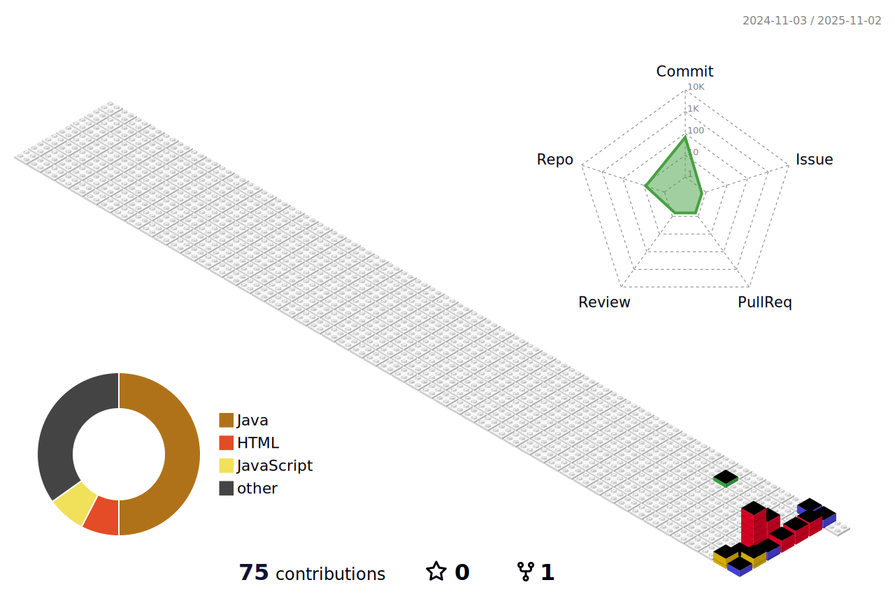

<!-- 🌈 MAIN PAGE BANNER -->

  

## 🔧 Skills

<table align="center">
  <tr>
    <th>Front-end</th>
    <td>
      
      
      
       
    </td>
  </tr>
  <tr>
    <th>Back-end</th>
    <td>
      
      
      
    </td>
  </tr>
  <tr>
    <th>Framework / Library</th>
    <td>
      
    </td>
  </tr>
  <tr>
    <th>Database</th>
    <td>
      
    </td>
  </tr>
</table>

  <table border="0" cellspacing="40">
    <tr>
      <td width="50%" valign="top">
        <h2>🌱 GitHub Activity</h2>
        
      </td>
      <td width="50%" valign="top">
        <h2>🪄 Links</h2>
        

          
           
          
        

      </td>
    </tr>
  </table>

---

<!-- 리드미 잔디 -->

  

